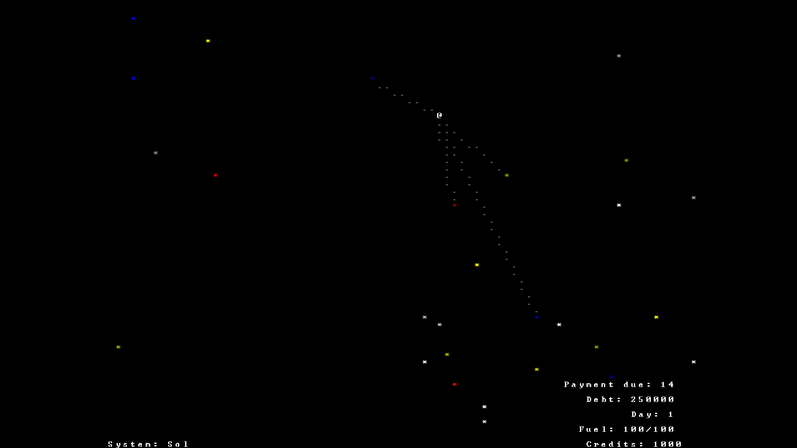

# SpaceRouge

SpaceRouge is a terminal-based science fiction roguelike focused on exploration, trading, and discovery. Built with Python and `tcod`, the game places you in command of a small spacecraft as you travel between star systems, trade commodities, uncover new locations, and gradually expand your reach across the galaxy.

Unlike traditional roguelikes that emphasize combat, SpaceRouge is designed around strategic exploration and economic progression. The goal is to create a relaxing but engaging experience where every jump into hyperspace presents new opportunities.

## Features

* Procedurally generated galaxy
* Multiple explorable star systems
* Planetary navigation
* Hyperspace travel between systems
* Trading and market mechanics
* Cargo and inventory management
* Message log for game events
* Typewriter-style story sequences
* Background music and sound effects
* ASCII graphics powered by `tcod`

## Screenshots



## Gameplay

The player begins with a small ship and a limited amount of cargo space. By purchasing commodities in one system and selling them elsewhere, players earn credits that can be reinvested into exploration.

Progress is driven by discovering new systems, optimizing trade routes, and expanding access to the galaxy rather than defeating enemies.

## Current Development

The following systems are currently implemented:

* Galaxy map
* Star systems
* Planets
* Jump points
* Hyperspace transitions
* Market interface
* Inventory system
* Trading mechanics
* Story screen
* Audio support

Planned features include:

* Mission system
* Expanded cargo mechanics
* Galaxy discovery progression
* Improved market interface
* Additional commodities
* Ship upgrades
* More events and encounters

## Installation

Clone the repository:

```bash
git clone https://github.com/yourusername/SpaceRouge.git
cd SpaceRouge
```

Create a virtual environment:

```bash
python -m venv .venv
```

Activate it.

Windows:

```bash
.venv\Scripts\activate
```

Linux/macOS:

```bash
source .venv/bin/activate
```

Install dependencies:

```bash
pip install -r requirements.txt
```

Run the game:

```bash
python main.py
```

## Controls

Controls are subject to change as development continues.

| Key                 | Action                   |
| ------------------- | ------------------------ |
| Arrow Keys / Numpad | Movement                 |
| Enter               | Confirm                  |
| Escape              | Back or Cancel           |
| Various Keys        | Navigation through menus |

## Technologies

* Python
* tcod
* miniaudio

## Project Structure

```text
SpaceRouge/
├── assets/
├── audio/
├── data/
├── src/
├── main.py
├── requirements.txt
└── README.md
```

The exact directory structure may change as the project evolves.

## Design Philosophy

SpaceRouge is built around a few core principles:

* Exploration over combat
* Simple mechanics with meaningful depth
* Clear ASCII presentation
* Gradual progression
* Replayability through procedural generation

The game aims to capture the feeling of commanding a lone spacecraft crossing a vast, unknown galaxy.

## Roadmap

* Complete mission framework
* Expand the economy
* Improve user interface
* Add more locations and events
* Introduce ship customization
* Polish game balance
* Prepare the first public release

## Contributing

Contributions, bug reports, and suggestions are welcome. Please open an issue or submit a pull request if you would like to help improve the project.

## License

This project is MIT licensed.
